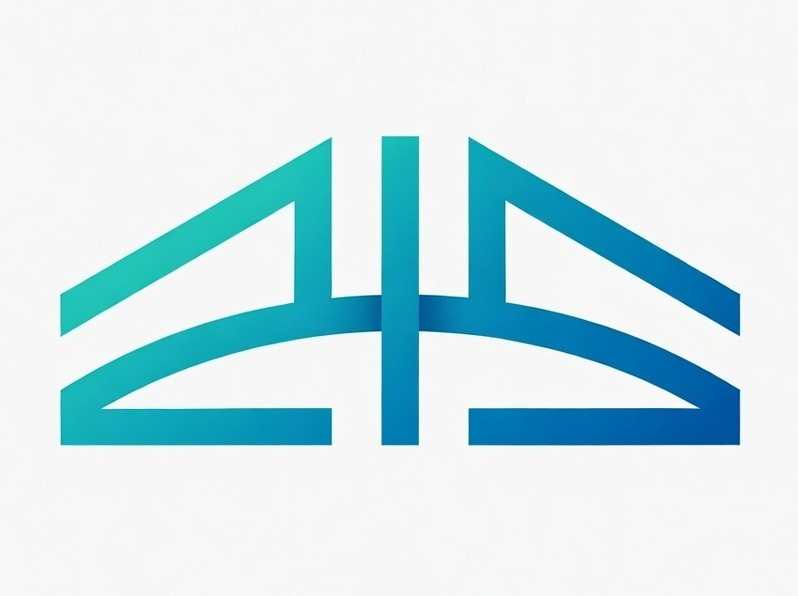

# 🌉 ExtBridge




**ExtBridge** is a cross-IDE extension deduplication tool for VS Code-compatible editors.
It keeps one shared local copy of each extension and links IDE-specific extension folders to that shared store.

## 🤔 Why ExtBridge?

Developers often use multiple VS Code-based IDEs (for example VS Code, Cursor, Windsurf, VSCodium, and Antigravity). Each IDE stores extension files independently, which causes:

- 💾 Duplicate disk usage
- 🕒 Version drift between IDEs
- 🔄 Repeated reinstall/setup work

ExtBridge solves this by centralizing extension storage in a single local location and linking each IDE to it.

## 🌟 Features & Scope

**Implemented:**

- 📦 Monorepo structure with `@iamjarvis/extbridge-core`, `@iamjarvis/extbridge-cli`, and `@iamjarvis/extbridge-gui`
- 🔌 IDE adapters for: **VS Code**, **Antigravity**, **Cursor**, **Windsurf**, **VSCodium**
- 🗃️ Central registry (`~/.extbridge/registry.json`) with Zod validation
- 🔑 Hash-based deduplication (SHA-256 of extension folders)
- 🔗 Cross-platform directory linking (Symlinks on Unix, Junctions on Windows)
- 🛠️ CLI commands to manage state (`init`, `sync`, `status`, `add`, `add-ide`, `import-ide`, `doctor`, `clean`, `watch`)
- 🖥️ **New Desktop GUI**: A beautifully designed Electron + React desktop application for visual management.
- 📥 Direct extension downloads from the Open VSX Marketplace
- ✅ Unit tests and Cross-Platform E2E GUI testing (Playwright)

## 📸 ExtBridge GUI


Manage your cross-IDE extensions entirely from our new Desktop Dashboard! Read more about it in the [GUI Documentation](documentation/gui.md).

## 📁 Project Structure

```text
extbridge/
├── packages/
│   ├── core/           # Core deduplication, registry, and adapters logic
│   ├── cli/            # ExtBridge CLI implementation (`extbridge <command>`)
│   └── gui/            # ExtBridge Desktop GUI (Electron + React + Vite)
├── documentation/      # Detailed guides (cli.md, gui.md)
├── package.json
├── pnpm-workspace.yaml
└── tsconfig.base.json
```

## ⚙️ Requirements

- **Node.js**: 20+
- **Corepack**: enabled (recommended)

If needed, enable corepack:

```bash
corepack enable
```

## 🚀 Getting Started

You can run ExtBridge CLI instantly using `npx`, or install it globally for convenience.

**Run instantly via npx:**

```bash
npx @iamjarvis/extbridge-cli status
```

**Install globally:**

```bash
npm install -g @iamjarvis/extbridge-cli
```

## 🛠️ Usage

For detailed command-line usage, check out the [CLI Documentation](documentation/cli.md).
For detailed desktop app usage, check out the [GUI Documentation](documentation/gui.md).

## 🏗️ CI & Testing

GitHub Actions CI runs on:

- 🐧 Linux (`ubuntu-latest`)
- 🪟 Windows (`windows-latest`)
- 🍏 macOS (`macos-latest`)

The workflow validates UI changes using **Playwright** E2E tests across all platforms, ensuring ExtBridge GUI runs perfectly everywhere.

## 📂 Storage Layout

ExtBridge uses the following local files/directories:

```text
~/.extbridge/
├── store/
└── registry.json
```

## ⚠️ Safety Notes

- Start with `--dry-run` before `init` on machines with important local setups.
- Use the new `doctor` command to diagnose broken symlinks.
- Review extension state with `status` before and after migration.

## 🤝 Contributing

See `CONTRIBUTING.md` for development workflow, coding standards, and pull request guidance.

## 🔐 Security

See `SECURITY.md` for vulnerability reporting instructions and Electron GUI security details.

## 📝 License

This project is licensed under the GNU General Public License v3.0.
See `LICENSE` for details.
