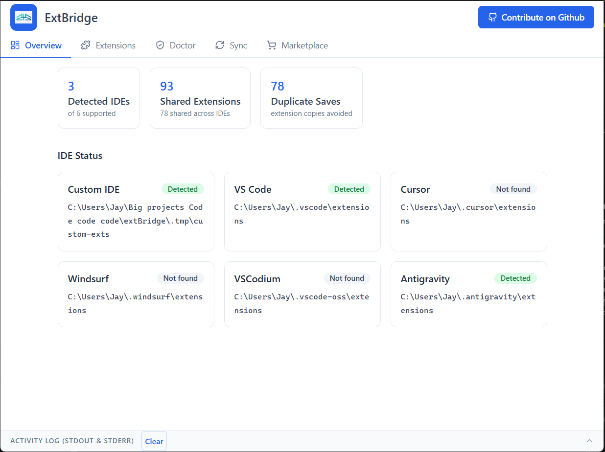

# ExtBridge GUI Documentation



The `@iamjarvis/extbridge-gui` application serves as the visual desktop counterpart to the CLI. Built on **Electron**, **React**, and **Vite**, it allows users to safely and easily manage their multi-IDE environments through an intuitive interface.

## 🚀 Launching the GUI

If you are developing or running from source:

```bash
cd packages/gui
npm run dev
```

You can also build the application into a standalone executable:

```bash
cd packages/gui
npm run package
```

The compiled applications will be available in the `dist-electron` and `out` directories (depending on your OS).

---

## 🎨 Design & Architecture

The ExtBridge GUI is built using modern web standards integrated natively into your OS:

- **Electron**: Powers the Desktop frame, provides access to the local filesystem (symlink creation, registry parsing), and handles native OS dialogs.
- **Vite & React**: The frontend is a fast, highly-responsive Single Page Application.
- **Tailwind CSS**: Using custom design tokens (`kit/DESIGN_KIT.md`) to create a polished, dark-themed experience.

---

## 🖥️ Features

### Visual Status Dashboard

Mirroring the `extbridge status` CLI command, the GUI's home screen provides a bright, visual breakdown of your deduplication savings, detected IDEs, and orphaned extensions.

### 1-Click Sync & Init

Instead of relying on terminal command flags, you can simply press the primary action buttons to securely initialize the shared store or sync broken links. The GUI maps directly to the safe `@iamjarvis/extbridge-core` methods.

### IDE Management Drawer

Add custom IDE paths, rename your editors, and configure import settings effortlessly. This visually replaces `add-ide` and `import-ide`.

### Live Extension Search (Open VSX)

Direct integration to search and download extensions from the Open VSX marketplace directly into the shared store, automatically trickling down to all active IDEs.

---

## 🧪 Testing

The ExtBridge GUI maintains high quality through automated Playwright testing. Every pull request runs the suite on Windows, macOS, and Linux to ensure the application window renders correctly and the React tree successfully bridges to the Node backend.

To run the GUI E2E tests:

```bash
cd packages/gui
npx playwright test
```
